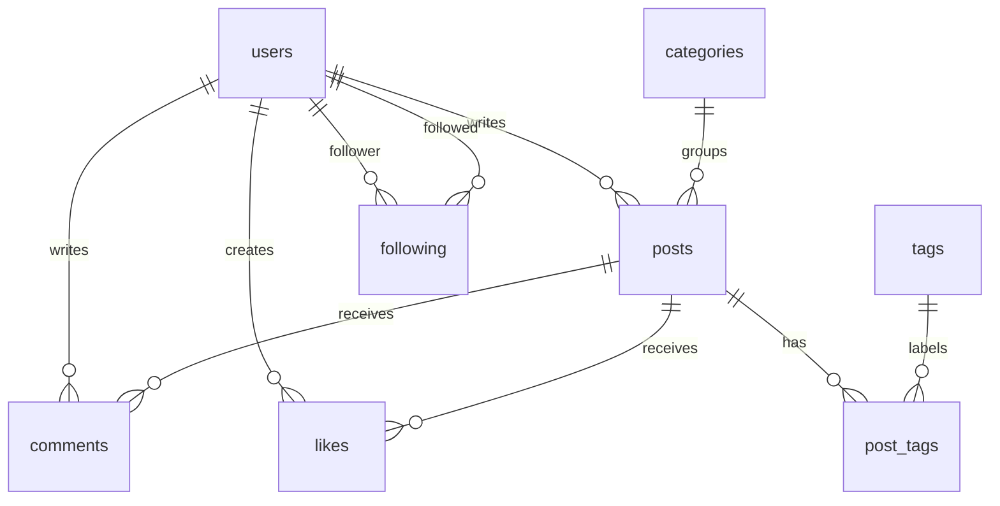

# PHP Blog — Kategori, Etiket ve Sosyal Etkileşim

PHP ve MySQL ile geliştirilmiş ders projesi. Kullanıcılar yazı yayımlayabilir, yorum yapabilir, gönderileri beğenebilir ve birbirini takip edebilir. Bu depo, mevcut veritabanı projesinin kurulum ve güvenlik düzeltmeleri eklenmiş portföy sürümüdür.

## Özellikler

- Kullanıcı kaydı, giriş ve çıkış; PHP oturum yönetimi.
- Gönderi oluşturma, kendi gönderisini düzenleme ve silme.
- Kategorilere göre filtreleme; virgülle ayrılmış etiketlerle gönderi oluşturma.
- Yorumlar, beğenme/beğeniyi geri alma, takip/takipten çıkma.
- Kullanıcı profilleri, takipçi sayıları ve kullanıcı listesi.
- Beğeni sayısına göre gönderi sıralama; gönderi/yorum sayılarına göre ilk 10 kullanıcı.

## Teknolojiler

PHP 8.1+, PDO MySQL, MySQL/MariaDB, HTML ve CSS. PHP `pdo_mysql` ve `mbstring` uzantıları gerekir. Framework veya Composer bağımlılığı yoktur.

## Yerel kurulum

1. MySQL/MariaDB sunucunuzu başlatın. `database/schema.sql` dosyasını phpMyAdmin ile **temiz bir yerel kurulumda** içe aktarın. Şema `portfolio_blog` veritabanını, 8 tabloyu ve üç örnek kategoriyi oluşturur. Kişisel kullanıcı verisi içermez.
2. Proje kökünde yapılandırma örneğini kopyalayın:

```powershell
Copy-Item config.example.php config.local.php
```

`config.local.php` içindeki bağlantı bilgilerini kendi kurulumunuza göre düzenleyin. Bu dosya `.gitignore` ile dışlanır. Alternatif olarak `BLOG_DB_HOST`, `BLOG_DB_PORT`, `BLOG_DB_NAME`, `BLOG_DB_USER`, `BLOG_DB_PASSWORD` ortam değişkenlerini kullanabilirsiniz; yerel yapılandırma dosyası önceliklidir.

3. Proje kökünde sunucuyu başlatın:

```powershell
php -S localhost:8081
# XAMPP kullanırken PHP PATH içinde değilse:
# C:\xampp\php\php.exe -S localhost:8081
```

4. `http://localhost:8081/register.php` adresinden kayıt olun. İkinci kullanıcı için ayrı bir tarayıcı profili veya gizli pencere kullanın.

Eski SQL dökümü bu pakete alınmadı. Eski MD5 parola kayıtları taşınmaz; temiz veritabanında yeni kullanıcı oluşturulur.

## Veri modeli



Sorgularda PDO parametreleri, JOIN, alt sorgu ve `COUNT(DISTINCT ...)` kullanılır. İlişkiler InnoDB yabancı anahtarlarıyla korunur; gönderi silinince ilişkili yorum, beğeni ve etiket bağlantıları temizlenir.

## Portföy hazırlığında yapılan değişiklikler

- Daha kapsamlı `veritabanıproje` sürümü temel alındı; `phpOdev` kopyasıyla dosya bazında karşılaştırıldı.
- MD5 yerine `password_hash` / `password_verify`; girişte oturum kimliği yenileme.
- Oturum kontrolü HTML şablonundan ayrıldı; yönlendirme öncesi çıktı hataları giderildi.
- Silme, beğeni, takip ve çıkış POST formlarına taşındı; POST isteklerine CSRF kontrolü eklendi.
- Eksik tabloları tamamlayan, kişisel kayıt içermeyen kurulum şeması hazırlandı.
- Etiketli gönderi oluşturma işlemi transaction içine alındı.
- Veritabanı ayarları kaynak kodundan ayrıldı; hata ayrıntıları kullanıcıya gösterilmez.

## Testler

PHP 8.2.12 ve ayrı bir MariaDB 10.4.32 veritabanında gerçek HTTP istekleri ve iki ayrı oturumla test edildi. Sözdizimi kontrolleri ve `tests/integration.py` geçti.

Test tekrarında **yalnızca deneme veritabanı kullanın**: test iki hesap ve bir gönderi oluşturur; kendi oluşturduğu gönderiyi sonunda siler. Veritabanınız hazır ve PHP sunucunuz çalışırken:

```powershell
$env:BLOG_TEST_URL = 'http://127.0.0.1:8081'
python tests/integration.py
```

Test; kayıt/giriş, yinelenen e-posta, hatalı parola, CSRF reddi, gönderi işlemleri, yetkisiz düzenleme/silme, HTML kaçışı, yorum, beğeni, takip ve çıkışı kontrol eder. Görsel tarayıcı/mobil testleri yapılmadı.

## Bilinen sınırlar

Sayfalama, arama, parola sıfırlama, e-posta doğrulama, hız sınırlama ve moderasyon yoktur. Gönderi düzenleme yalnızca başlık ve içeriği değiştirir; kategori/etiket düzenleme henüz yoktur. Mevcut çalışma yerel ders demosudur; genel erişime açık sunucuya dağıtım yapılmadı.

GitHub profili: [nursimaotcu](https://github.com/nursimaotcu). Ders projesi ile portföy hazırlığında eklenen düzeltmeler yukarıda ayrı belirtilmiştir.
